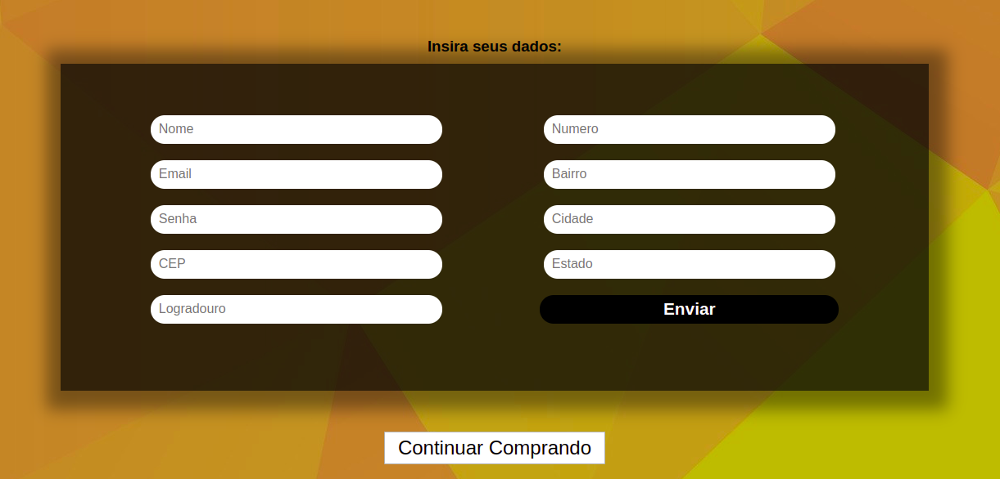
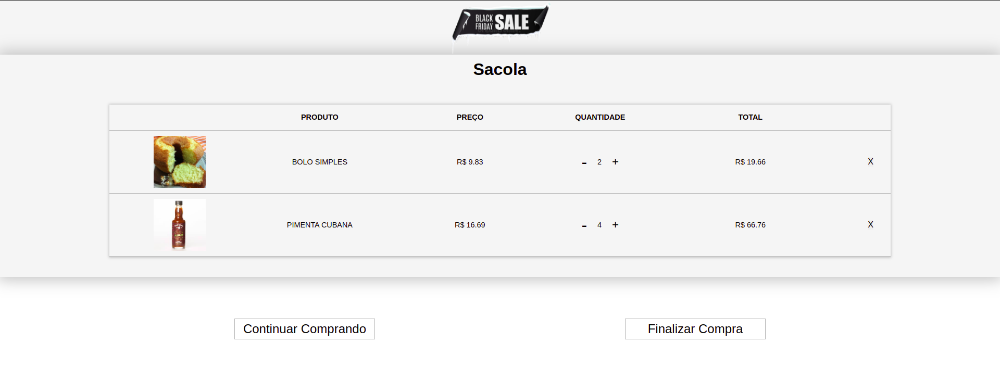

# Desafio 2 - Hiring Coders
## Ecommerce Mercadinho Online

Para iniciar o desenvolvimento, é necessário clonar o projeto do Github em um diretório de sua preferência: 
`git clone https://github.com/jovenan/Ecommerce-HC-Mercadinho.git`

Para instalar os pacotes:
`npm i`

Para iniciar em modo de desenvolvimento:
`npm start`

Para acessar a página em produção [clique aqui](#)

### A aplicação

Este projeto tem por finalidade simular um ecommerce simples com uma vitrine de produtos, sendo possivel adiciona-los ao carrinho e utilizar de um sistema de cadastro de usuarios e login. 

A base de dados de produtos, são armazenadas em um arquivo JSON dentro do projeto.

Todos os dados de produtos no carrinho, cadastro e login, são armazenados no LocalStorage.

### Funcionalidades da aplicação

- Compra de produtos por adição ao carrinho.

- Para adicionar ao carrinho algum produto basta clicar no botão "Comprar".

- Sistema de cadastro de usuário com Login.

- Página de carrinho com os produtos. Podendo utilizar as funcionalidades de quantidades e exclusão.

## Desenvolvedor Jonatas Venâncio
